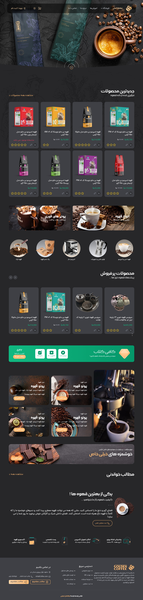

## Coffee Shop (React JS)
This project only contains Front-End code and does not include Back-end code

Pages of this project :
Login, registration,
user profile, articles,
shopping cart, about store and 404 error

### Technologies used :
- React JS
- react router dom
- Tailwindcss
- Css
- SweetAlert
- Swiper JS

### [Contact me through Telegram](https://t.me/vc_abolfazl)

### Project pages
```js

let Router = [

    { path: '/', element: <Home /> },
    { path: '/Login', element: <Login /> },
    { path: '/signup', element: <Signup /> },
    { path: '/forgotPassword', element: <ForgotPassword /> },
    { path: '/Products', element: <AllProducts /> },
    { path: '/Products/:category', element: <AllProducts /> },
    { path: '/product/:id', element: <AboutProduct /> },
    { path: '/Blogs', element: <BlogPage /> },
    { path: '/Blogs/Blog/:id', element: <AboutBlog /> },
    { path: '/Cart', element: <Cart /> },
    { path: '/Information', element: <AboutStore /> },
    { path: '/Profile', element: <Profile />,
        children: [
            { path: '/Profile', element: <Information /> },
            { path: 'Order', element: <Order /> },
            { path: 'Password', element: <ForgotPasswordUser /> },
          ]
    },
    { path: '*', element: <Error /> },
]
```
## A view of the site


